# MilkFlow — Diagrama Entidad-Relación

> Todas las tablas sincronizables comparten `id (uuid, PK)`, `version (bigint)`,
> `deleted (bool)`, `created_at`, `updated_at`. Se omiten en el diagrama por
> brevidad; solo se muestran las columnas con significado de dominio.

```mermaid
erDiagram
    usuarios {
        uuid id PK
        string dni UK
        string rol "enum RolUsuario"
        bool activo
    }
    dispositivos {
        uuid id PK
        uuid usuario_id FK
        string identificador UK
        timestamptz ultima_sincronizacion_en
    }
    rutas {
        uuid id PK
        string nombre UK
    }
    zonas {
        uuid id PK
        uuid ruta_id FK
        string nombre UK
    }
    acopiadores {
        uuid id PK
        uuid usuario_id FK
        uuid ruta_id FK
        date vigente_desde
        date vigente_hasta
    }
    productores {
        uuid id PK
        uuid usuario_id FK "nullable"
        uuid zona_id FK
        string codigo_padron UK
        string dni UK
        string estado "enum EstadoProductor"
    }
    productos {
        uuid id PK
        string tipo
        decimal rendimiento_min_por_100l
        decimal rendimiento_max_por_100l
    }
    precios_venta {
        uuid id PK
        uuid producto_id FK
        string tipo_cliente
        decimal precio
        date vigente_desde
        date vigente_hasta "nullable = vigente"
    }
    precios_compra_leche {
        uuid id PK
        decimal precio_litro
        decimal precio_litro_minimo
        date vigente_desde
        date vigente_hasta
    }
    clientes {
        uuid id PK
        string tipo_cliente
    }
    rutas_acopio {
        uuid id PK
        uuid acopiador_id FK
        uuid ruta_id FK
        uuid dispositivo_id FK
        date fecha
        string estado "en_curso|cerrada|descargada|conciliada"
    }
    registros_acopio {
        uuid id PK
        uuid ruta_acopio_id FK
        uuid productor_id FK
        decimal litros
        timestamptz hora_registro
    }
    descargas_tina {
        uuid id PK
        uuid ruta_acopio_id FK "UK"
        decimal litros_descargados
    }
    conciliaciones {
        uuid id PK
        uuid ruta_acopio_id FK "UK"
        decimal litros_acopiador
        decimal litros_caudalimetro
        decimal diferencia_porcentaje "persistido"
        bool tiene_alerta "persistido"
    }
    controles_calidad {
        uuid id PK
        uuid productor_id FK
        uuid supervisor_id FK
        decimal agua_anadida_porcentaje
        decimal ph
        string dictamen "persistido, enum DictamenCalidad"
        bool es_reincidencia
    }
    capacitaciones {
        uuid id PK
        uuid productor_id FK
        uuid control_calidad_id FK
        string estado
    }
    sanciones {
        uuid id PK
        uuid productor_id FK
        uuid control_calidad_id FK
        uuid semana_pago_id FK "nullable"
        string tipo "enum TipoSancion"
        decimal porcentaje_descuento
        decimal monto_descuento "congelado al liquidar"
        decimal tarifa_degradada_litro
        bool aplicada_en_liquidacion
    }
    semanas_pago {
        uuid id PK
        date fecha_inicio "jueves"
        date fecha_fin "miercoles"
        date fecha_liquidacion "viernes"
        uuid precio_compra_leche_id FK "tarifa congelada"
        string estado
    }
    liquidaciones {
        uuid id PK
        uuid semana_pago_id FK
        uuid productor_id FK
        decimal litros_totales
        decimal precio_litro_aplicado "snapshot"
        bool tarifa_degradada
        decimal monto_bruto
        decimal total_descuentos
        decimal monto_neto
    }
    detalle_liquidacion {
        uuid id PK
        uuid liquidacion_id FK
        string concepto
        decimal monto "con signo"
    }
    sesiones_produccion {
        uuid id PK
        uuid producto_id FK
        uuid jefe_produccion_id FK
        decimal litros_procesados
        int unidades_producidas
        decimal rendimiento_por_100l "persistido"
        bool cumple_rn08 "persistido"
        string estado
    }
    movimientos_stock {
        uuid id PK
        uuid producto_id FK
        string tipo_movimiento "enum"
        decimal cantidad "con signo, != 0"
        string origen_tipo
        uuid origen_id
    }
    stock_actual {
        uuid producto_id PK "MATERIALIZED VIEW"
        decimal cantidad_actual "SUM(movimientos)"
    }
    correlativos {
        uuid id PK
        string tipo_comprobante
        string serie
        bigint numero_maximo_asignado
    }
    rangos_correlativo {
        uuid id PK
        uuid correlativo_id FK
        uuid dispositivo_id FK
        bigint numero_desde
        bigint numero_hasta
        bigint numero_siguiente
    }
    ventas {
        uuid id PK
        uuid cliente_id FK
        uuid rango_correlativo_id FK
        bigint numero_comprobante
        decimal total
    }
    detalle_ventas {
        uuid id PK
        uuid venta_id FK
        uuid producto_id FK
        uuid precio_venta_id FK "precio historizado usado"
        decimal precio_unitario "snapshot"
    }
    solicitudes_cambio_zona {
        uuid id PK
        uuid productor_id FK
        uuid zona_actual_id FK
        uuid zona_solicitada_id FK
        string estado "pendiente|aprobada|rechazada"
    }
    avisos {
        uuid id PK
        uuid creado_por FK
        string imagen_url
        timestamptz fecha_publicacion
        bool obligatorio
    }
    avisos_vistos {
        uuid id PK
        uuid aviso_id FK
        uuid productor_id FK
    }
    asambleas {
        uuid id PK
        int padron_snapshot "congelado"
        int quorum_requerido "congelado"
        bool quorum_alcanzado
    }
    asistencias_asamblea {
        uuid id PK
        uuid asamblea_id FK
        uuid productor_id FK "nullable"
        string dni "UK con asamblea_id"
    }
    sync_logs {
        uuid id PK
        uuid dispositivo_id FK
        string direccion "bajada|subida"
        string entidad
        int conflictos
    }

    usuarios ||--o{ dispositivos : "posee"
    usuarios ||--o| acopiadores : "es"
    usuarios ||--o| productores : "puede ser"
    rutas ||--o{ zonas : "agrupa"
    rutas ||--o{ acopiadores : "asignados"
    zonas ||--o{ productores : "ubica"
    acopiadores ||--o{ rutas_acopio : "realiza"
    rutas ||--o{ rutas_acopio : "recorrida en"
    dispositivos ||--o{ rutas_acopio : "registra desde"
    rutas_acopio ||--o{ registros_acopio : "detalla"
    productores ||--o{ registros_acopio : "entrega"
    rutas_acopio ||--o| descargas_tina : "cierra con"
    rutas_acopio ||--o| conciliaciones : "se concilia en"
    usuarios ||--o{ conciliaciones : "registra"
    productores ||--o{ controles_calidad : "evaluado en"
    usuarios ||--o{ controles_calidad : "supervisa"
    rutas_acopio ||--o{ controles_calidad : "muestra de"
    controles_calidad ||--o| sanciones : "genera"
    controles_calidad ||--o| capacitaciones : "deriva a"
    productores ||--o{ sanciones : "recibe"
    productores ||--o{ capacitaciones : "asignada"
    semanas_pago ||--o{ sanciones : "descuenta en"
    precios_compra_leche ||--o{ semanas_pago : "tarifa de"
    semanas_pago ||--o{ liquidaciones : "contiene"
    productores ||--o{ liquidaciones : "cobra"
    liquidaciones ||--o{ detalle_liquidacion : "compone"
    productos ||--o{ sesiones_produccion : "produce"
    usuarios ||--o{ sesiones_produccion : "dirige"
    productos ||--o{ movimientos_stock : "mueve"
    sesiones_produccion ||--o{ movimientos_stock : "ingresa (polimorfico)"
    ventas ||--o{ movimientos_stock : "egresa (polimorfico)"
    productos ||--|| stock_actual : "proyecta"
    correlativos ||--o{ rangos_correlativo : "divide en"
    dispositivos ||--o{ rangos_correlativo : "reserva"
    clientes ||--o{ ventas : "compra"
    rangos_correlativo ||--o{ ventas : "numera"
    ventas ||--o{ detalle_ventas : "detalla"
    productos ||--o{ detalle_ventas : "vendido en"
    precios_venta ||--o{ detalle_ventas : "precio usado"
    productores ||--o{ solicitudes_cambio_zona : "solicita"
    zonas ||--o{ solicitudes_cambio_zona : "origen"
    zonas ||--o{ solicitudes_cambio_zona : "destino"
    usuarios ||--o{ avisos : "publica"
    avisos ||--o{ avisos_vistos : "acusado por"
    productores ||--o{ avisos_vistos : "confirma"
    asambleas ||--o{ asistencias_asamblea : "registra"
    productores ||--o{ asistencias_asamblea : "asiste"
    dispositivos ||--o{ sync_logs : "sincroniza"
```

