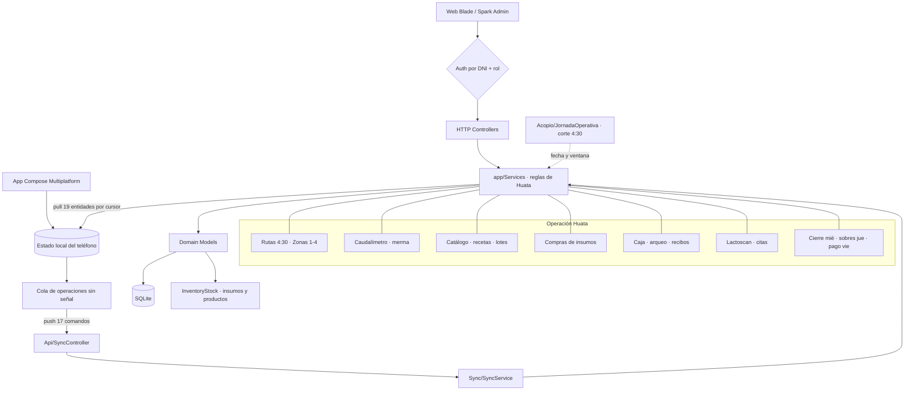
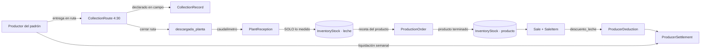

# 🏛️ Arquitectura Global — MilkFlow / Ayni Huata (Web + Móvil)

> Última auditoría `$archi`: 2026-09-22 — retiro del módulo Quesería (web, móvil y tabla), catálogo abierto de producción (categorías → insumos → productos/recetas → lotes), compras de insumos, tipos de cliente con tarifa por producto, patrón de tabla único y jornada operativa 4:30→4:30.

## 1. Capas del sistema

Dos aplicaciones sobre **una sola base de datos**: el panel web de planta y la app móvil que trabaja en ruta sin cobertura. Las reglas viven en un único lugar (`app/Services/`) y ambas las consumen.

| Capa | Ubicación | Qué contiene |
|---|---|---|
| **Web UI** | `MilkFlowWeb/resources/views/` | 41 vistas Blade; patrón único `<x-tabla>` + `<x-paginador>` |
| **Móvil UI** | `MilkFlowMovil/shared/src/commonMain/.../ui/` | 23 pantallas Compose Multiplatform, por rol |
| **HTTP Controllers** | `MilkFlowWeb/app/Http/Controllers/` | 21 web + 2 API (`Api/SyncController`, `Api/MobileSyncController`) |
| **Domain Services** | `MilkFlowWeb/app/Services/` | 15 servicios: **fuente única** de las reglas de Huata |
| **Sync Engine** | `app/Services/Sync/` + `MilkFlowMovil/.../datos/` | 17 comandos push, 19 entidades pull, idempotencia por `client_uuid` |
| **Domain Models** | `MilkFlowWeb/app/Models/` | 34 modelos Eloquent con sus cálculos encapsulados |
| **Persistencia servidor** | `MilkFlowWeb/database/` | **SQLite** (`database/database.sqlite`), `client_uuid` único, índice en `updated_at` |
| **Persistencia dispositivo** | `MilkFlowMovil/.../datos/local/` | Documento JSON: estado sincronizado + cola de operaciones pendientes |

> ⚠️ La base es **SQLite**, no MySQL. Para inspeccionar el esquema: `PRAGMA table_info(tabla)`, nunca `SHOW COLUMNS`.

## 2. Mapa general

## 3. Cadena de la leche (invariante central)

**La leche entra al stock únicamente por el caudalímetro de planta**, nunca por lo declarado en ruta. Es lo que permite medir la merma. Al productor se le paga por liquidación semanal, no por compra.

## 4. Servicios de dominio

| Servicio | Responsabilidad |
|---|---|
| `Acopio/AcopioService` | Ruta del día, entregas, cierre de ruta |
| `Acopio/JornadaOperativa` | Corte 4:30: `fecha()`, `hora()`, `ventana()` |
| `Acopio/TarifaAcopioService` | Reglas de precio de leche por métrica de calidad |
| `Planta/PlantaService` | Verificación con caudalímetro y delta de stock |
| `Produccion/CatalogoService` | Categorías, unidades, insumos, productos y recetas |
| `Produccion/AlmacenService` | Movimiento de stock y kardex (`supply_movements`) |
| `Produccion/ComprasService` | Compras de insumos y costo promedio ponderado |
| `Produccion/ProduccionService` | Lotes: planificar, iniciar, terminar, cancelar |
| `Ventas/VentaService` | Venta multiproducto, tarifas por tipo de cliente, arqueo |
| `Calidad/CalidadService` | Lactoscan, veredicto y citas técnicas |
| `Pagos/LiquidacionService` | Ciclo semanal, deducciones y sobres |
| `Zonas/ZonaService` | Zonas 1-4 y solicitudes de rotación |
| `Sistema/SistemaService` | Panel del sistema, usuarios y catálogos |
| `Sync/SyncService` | Push de 17 comandos, pull por cursor |
| `Sync/ResolutorAmbito` | Qué filas ve cada rol en la bajada |

## 5. Índice de módulos

* 🥛 **[Acopio y Zonas (4:30 AM)](architecture/modules/acopio.md)** — 4 zonas, ruta del día, cierre y candados de jornada.
* 🏭 **[Planta y Caudalímetro](architecture/modules/planta.md)** — ingreso estricto a stock, corrección delta, merma.
* 📦 **[Producción: catálogo, recetas y lotes](architecture/modules/produccion.md)** — categorías → insumos → productos → lotes; almacén compartido.
* 🧾 **[Compras de insumos](architecture/modules/compras.md)** — boleta, costo promedio ponderado, la leche nunca se compra.
* 🛒 **[Ventas, Caja y Calidad](architecture/modules/ventas_calidad.md)** — tipos de cliente, arqueo, Lactoscan y citas.
* 💰 **[Precios, Autorización y Pagos en Ruta](architecture/modules/precios_pagos.md)** — tarifas, penalidades, sobres.
* 👤 **[Portal del Productor](architecture/modules/productor.md)** — acopio de hoy, acumulador, descuentos, calidad.
* 📱 **[App Móvil (KMP)](architecture/modules/movil.md)** — 23 pantallas, base local, navegación por rol.
* 🔄 **[Sincronización Offline-First](architecture/modules/sincronizacion.md)** — cursor, cola, idempotencia, rechazos.

## 6. Guías transversales

* 🧭 **[Mapa Global de Rutas](architecture/routes_map.md)** — 97 rutas web + 10 endpoints API.
* 🎨 **[Sistema de Diseño](architecture/core/ui_theme.md)** — Spark Admin y el patrón `<x-tabla>`.
* 🔄 **[Flujo de Datos y Estado](architecture/core/data_flow.md)** — stock, jornada operativa, ciclo de pagos.
* 📏 **[Reglas de Importación](architecture/core/import_rules.md)** — jerarquía de capas en servidor y teléfono.

## 7. Invariantes

Reglas que ningún cambio debe romper:

1. **Una sola implementación por regla.** Toda lógica vive en `app/Services/`. Un controlador que calcula por su cuenta desincroniza el teléfono respecto de la planta.
2. **Ninguna pantalla móvil llama a la red.** La UI lee de la base local; las acciones escriben ahí y encolan. Es lo que permite acopiar a las 4:30 sin cobertura.
3. **El servidor es la autoridad.** El teléfono calcula optimista para mostrar al instante, pero el servidor recalcula y su resultado manda.
4. **La jornada no es el día del calendario.** Corre de 4:30 a 4:30. Lo que tiene hora (`sold_at`) se filtra por `JornadaOperativa::ventana()`, nunca por `whereDate`.
5. **La leche entra solo por caudalímetro** y se paga solo por liquidación. Nunca por compra.
6. **Un rechazo de negocio no se reintenta.** `ReglaNegocioException` le dice al móvil que descarte la operación en vez de reencolarla.
