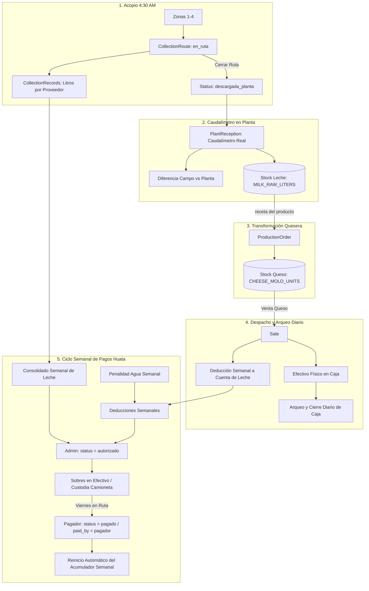
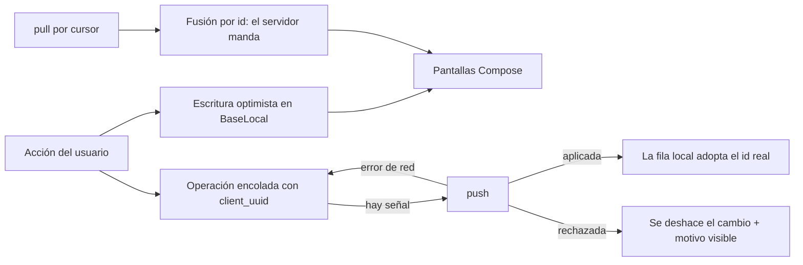

# 🔄 Flujo de Datos y Estado Global — MilkFlow Huata

## 1. Ciclo de Vida de Leche, Queso y Fondos en Efectivo

## 2. Reglas de Mutación de Inventario y Fondos

1. **Ingreso Leche Cruda (`MILK_RAW_LITERS`)**:
   - Incrementa exclusivamente con los litros del **caudalímetro real** (`flowmeter_liters`). En caso de corrección posterior, aplica ajuste delta.
2. **Consumo Leche Cruda (`MILK_RAW_LITERS`)**:
   - Reduce exactamente `cheese_molds_produced * 10` litros con chequeo atómico de stock.
3. **Inventario de Queso (`CHEESE_MOLD_UNITS`)**:
   - Incrementa con cada lote producido y decrementa con cada venta confirmada.
4. **Ciclo Semanal de Pagos en Efectivo**:
   - **Miércoles:** Cierre y autorización del Admin (`status = autorizado`).
   - **Jueves:** Conteo y armado de sobres físicos.
   - **Viernes:** Entrega en ruta por el pagador (`status = pagado`). El acumulador semanal se reinicia automáticamente para el nuevo ciclo.

## 3. Estado Local del Dispositivo

El teléfono mantiene su propia copia del estado. No es un caché de conveniencia: es la fuente que alimenta a todas las pantallas, porque el acopio ocurre donde no hay señal.

## 4. Reglas de Mutación del Estado Local

1. **Filas provisionales**: nacen con id negativo y `client_uuid`; al confirmarse adoptan el id del servidor. La fusión de la bajada respeta las filas pendientes porque sus ids nunca colisionan con los reales.
2. **Stock optimista**: verificar el caudalímetro, producir queso o vender ajusta el stock local de inmediato con el mismo delta que aplicará el servidor, para que la siguiente pantalla muestre un número coherente.
3. **Cursores por entidad**: cada entidad guarda su propio cursor `updated_at`; una bajada truncada por el tope de filas continúa desde donde quedó, sin perder cambios.
4. **Un solo usuario por dispositivo**: iniciar sesión con otra persona limpia el documento completo.
5. **Reintento escalonado**: cada minuto mientras haya cola o un error pendiente, cada cinco cuando todo está al día.
