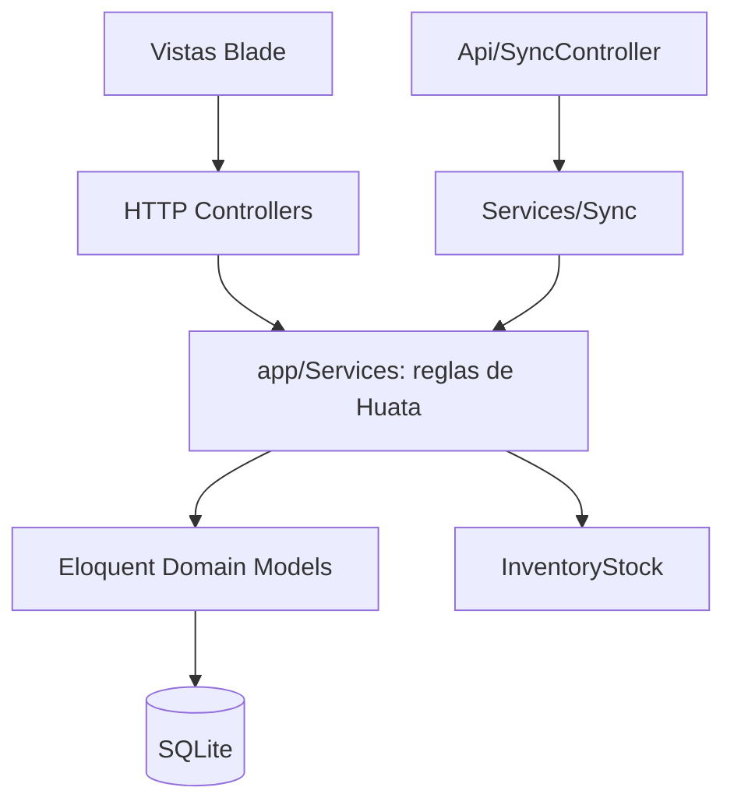
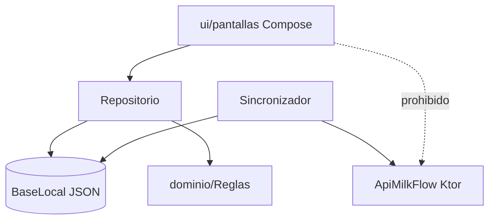

# 📏 Reglas de Importación y Dependencias — MilkFlow Huata

## 1. Jerarquía de Capas — Servidor

## 2. Jerarquía de Capas — Dispositivo

## 3. Convenciones y Restricciones Estrictas

1. **Vistas Blade (`resources/views/`)**:
   - Prohibido ejecutar consultas directas a la base de datos o llamadas a modelos desde las vistas (`User::where...`). Todo dato debe ser inyectado desde el controlador.
2. **Controladores (`app/Http/Controllers/`)**:
   - Validan la solicitud mediante `$request->validate(...)` y **delegan en `app/Services/`**. No calculan precios, stock ni liquidaciones por su cuenta: esa lógica la comparten con la app móvil.
   - Capturan `ReglaNegocioException` y la traducen a `withErrors()` o `with('error')` para la vista.
3. **Servicios (`app/Services/`)**:
   - Contienen la regla de negocio y son la **fuente única** para el web y para el API móvil.
   - Envuelven en `DB::transaction` toda escritura que toque stock, liquidaciones o correlativos.
   - Lanzan `ReglaNegocioException` cuando el rechazo es definitivo (el móvil no debe reintentar).
4. **Modelos (`app/Models/`)**:
   - Definen atributos en `$fillable` de forma explícita, incluido `client_uuid` en las tablas sincronizables.
   - Encapsulan cálculos de dominio propios de la entidad (`Customer::determineUnitPrice()`, `InventoryStock::adjustStock()`).
5. **API Móvil (`app/Http/Controllers/Api/`)**:
   - Exclusivamente intercambio de datos en JSON, autenticación stateless con Laravel Sanctum (`auth:sanctum`).
   - `SyncController` no contiene reglas: arma la petición y llama a `SyncService`, que a su vez llama a los servicios de dominio.
6. **Pantallas del móvil (`shared/.../ui/`)**:
   - **Nunca importan `datos/remoto/`.** Observan `Repositorio.estado` y llaman a sus acciones; la red es asunto exclusivo del `Sincronizador`.
   - No calculan reglas de negocio en el composable: usan `dominio/Reglas`.
7. **Dominio del móvil (`shared/.../dominio/`)**:
   - No importa nada de `datos/`: son modelos y funciones puras, testeables en `commonTest` sin red ni disco.
