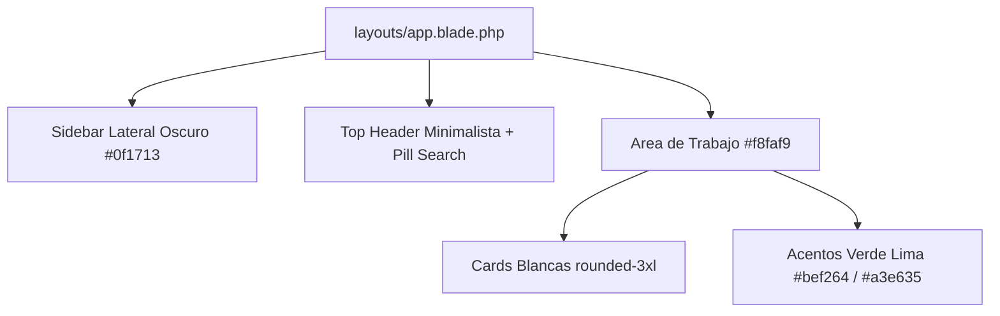

# Guía de Arquitectura UI: Tema Spark Admin

## Especificaciones de Diseño
- **Layout**: 2 columnas (Sidebar fijo/colapsable lateral izquierdo + Top navbar + Workspace).
- **Sidebar**: Fondo oscuro `#0f1713` / `#16221c`, ícono de estrella/flor verde lima, enlaces organizados por rol y sección semántica, badge de conteo e indicador activo redondeado.
- **Top Header**: Buscador pill redondeado `rounded-full`, botón de acción rápida `+ Venta` (`#0f1713` con hover a `#bef264`), campana de notificaciones, menú desplegable con avatar y rol de usuario.
- **Componentes**:
  - Hero Card oscuro con acento lima e icono floral/estrella.
  - Métricas numéricas de 32px con porcentaje de variación y micro-gráficos SVG.
  - Tablas limpias sin bordes pesados, celdas con espaciado amplio y badges suaves.
  - Formularios con inputs redondeados `rounded-2xl` y fondo sutil `bg-slate-50/50`.
