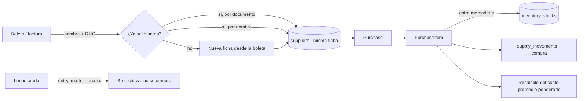

# 🧾 Módulo: Compras de insumos

> **No es el padrón de proveedores.** Aquí solo se anota lo que se compró para actualizar stock y costo: fruta, envases, cuajo. Los proveedores de la asociación son **los productores de leche**, y sus beneficios salen de su rol en el padrón.

## 1. Flujo

## 2. Por qué la leche no se compra aquí

La leche entra al almacén por el **caudalímetro de planta** y se paga en la **liquidación semanal**, con su penalidad por agua. Registrarla además como compra la contaría y la pagaría dos veces. `supplies.entry_mode` distingue `compra` de `acopio`, y `ComprasService` rechaza cualquier renglón de un insumo con `entry_mode = acopio`.

## 3. Componentes

| Componente | Archivo | Responsabilidad |
|---|---|---|
| `ComprasService` | `app/Services/Produccion/ComprasService.php` | Registrar, corregir, anular; dedupe de ficha; costo promedio |
| `ComprasController` | `/produccion/compras` | Pantalla única: historial + modal de alta |
| `Purchase`, `PurchaseItem`, `Supplier` | `app/Models/` | Compra, sus renglones y a quién se le compró |

## 4. Reglas

* **Se sube como quien copia una boleta.** Nombre o razón social + RUC/DNI, sin paso previo de crear proveedor.
* **Anti-duplicado.** Si el RUC —o, a falta de RUC, el nombre— ya salió en una compra anterior, la nueva se le carga a la misma ficha. No hay padrón que mantener a mano.
* **El costo promedio se recalcula entero.** No se acumula: se recomputa desde todos los `purchase_items` del insumo. Así corregir o anular una compra vieja deja el costo correcto.
* **Verificar antes de mover.** `verificarQueSePuedaDevolver()` corre **antes** de tocar el stock, porque `adjustStock` hace `max(0, …)` y clamparía en silencio.

## 5. Tests

`ComprasInsumosTest`, `ProveedorYLecheTest`.
