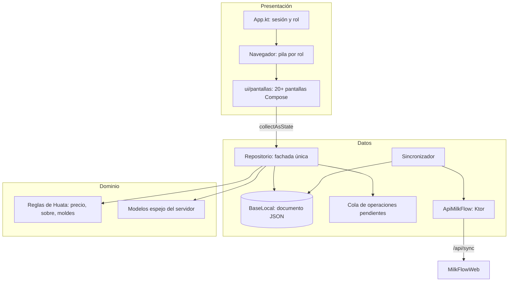

# 📱 Módulo: App Móvil (Kotlin Multiplatform)

Proyecto `MilkFlowMovil/` — Compose Multiplatform sobre Android e iOS, paquete `com.example.milkflowmovil`.
Replica las pantallas del panel web para usarse en ruta, donde no hay cobertura.

## 1. Diagrama de Capas

## 2. Componentes Clave

| Componente | Archivo | Responsabilidad |
|---|---|---|
| `App` / `Caparazon` | `shared/.../App.kt` | Decide sesión, arma el menú del rol y enruta la pantalla activa |
| `Navegador` | `shared/.../ui/Navegacion.kt` | Pila de pantallas propia; `Rol.puedeVer` bloquea destinos ajenos |
| `Rol` / `Pantalla` | `shared/.../dominio/Roles.kt` | Los 9 roles y el menú que ve cada uno |
| `Reglas` | `shared/.../dominio/Reglas.kt` | Precio de leche y queso, sobre semanal, moldes posibles, merma |
| `Modelos` | `shared/.../dominio/Modelos.kt` | Espejo de las tablas del servidor con serializadores tolerantes |
| `BaseLocal` | `shared/.../datos/local/BaseLocal.kt` | Documento JSON del teléfono; escritura a temporal y renombrado |
| `EstadoLocal` | `shared/.../datos/local/EstadoLocal.kt` | Estado completo: entidades, cursores, cola y rechazos |
| `Repositorio` | `shared/.../datos/Repositorio.kt` | Fachada única de la UI: cambio optimista + encolado de la operación |
| `Sincronizador` | `shared/.../datos/Sincronizador.kt` | Sube la cola, baja los deltas y reconcilia ids |
| `ApiMilkFlow` | `shared/.../datos/remoto/ApiMilkFlow.kt` | Cliente Ktor de `/api/sync/*`; traduce fallos a `ErrorApp` |
| `Contenedor` | `shared/.../di/Contenedor.kt` | Armado manual de las cuatro piezas (sin librería de inyección) |
| `TemaMilkFlow` | `shared/.../ui/tema/Tema.kt` | Paleta del panel web (#0F1713 / #BEF264) en claro y oscuro |

## 3. Pantallas por Rol

Cada rol arranca en la primera pantalla de su menú, igual que el web redirige por rol.

| Rol | Pantallas |
|---|---|
| Acopiador | Acopio 4:30 AM · Historial y reportes |
| Productor | Mi acopio · Cambio de zona · Descuentos · Historial de pagos · Calidad |
| Jefe de producción | Caudalímetro |
| Inspector de calidad | Panel · Lactoscan y citas |
| Personal de venta | Panel · Ventas · Nueva venta · Recibos · Recibo |
| Personal de pago | Panel · Autorizar pagos · Sobres en ruta · Historial de sobres |
| Pagador de campo | Sobres en ruta · Historial de sobres |
| Administración | Panel · Historial · Zonas · Solicitudes · Calidad · Flujo de caja · Recibos · Autorizar pagos · Tarifas · Avisos |
| Jefe general | Todas las anteriores |

Todos los roles incluyen además **Sincronización** (cola, rechazos y dirección del servidor).

## 4. Reglas Operativas

1. **La UI nunca toca la red.** Las pantallas observan `Repositorio.estado`; una pantalla que llamara al API dejaría de funcionar en ruta.
2. **Escritura optimista.** Cada acción escribe en la base local y encola la operación: el acopiador ve los litros registrados al instante, con o sin señal.
3. **Ids provisionales negativos.** Una fila creada sin señal nace con id negativo y su `client_uuid`; al confirmarla el servidor adopta el id real. `reservarIdTemporal()` nunca debe invocarse dentro de un bloque `base.actualizar {}`.
4. **Base local de un solo usuario.** Al iniciar sesión otra persona se limpia todo el documento: el teléfono jamás mezcla padrones ni sobres de dos usuarios.
5. **Cálculo local, autoridad remota.** `Reglas` replica las fórmulas de Huata para la vista previa; el servidor las recalcula al aplicar la operación y su número es el que queda.
6. **Decimales tolerantes.** El servidor puede enviar los decimales como texto o como número según el motor: los serializadores `DobleFlexible`, `EnteroFlexible` y `BooleanoFlexible` aceptan ambas formas.

## 5. Por Qué un Documento JSON y No SQLite

A la escala de la asociación (decenas de proveedores, cientos de entregas por semana) el estado completo cabe en memoria y el guardado atómico basta, evitando arrastrar un generador de código al proyecto. Si el padrón creciera a miles de filas, el reemplazo natural es SQLDelight detrás de la misma interfaz `BaseLocal`, sin tocar la UI ni el `Repositorio`.
