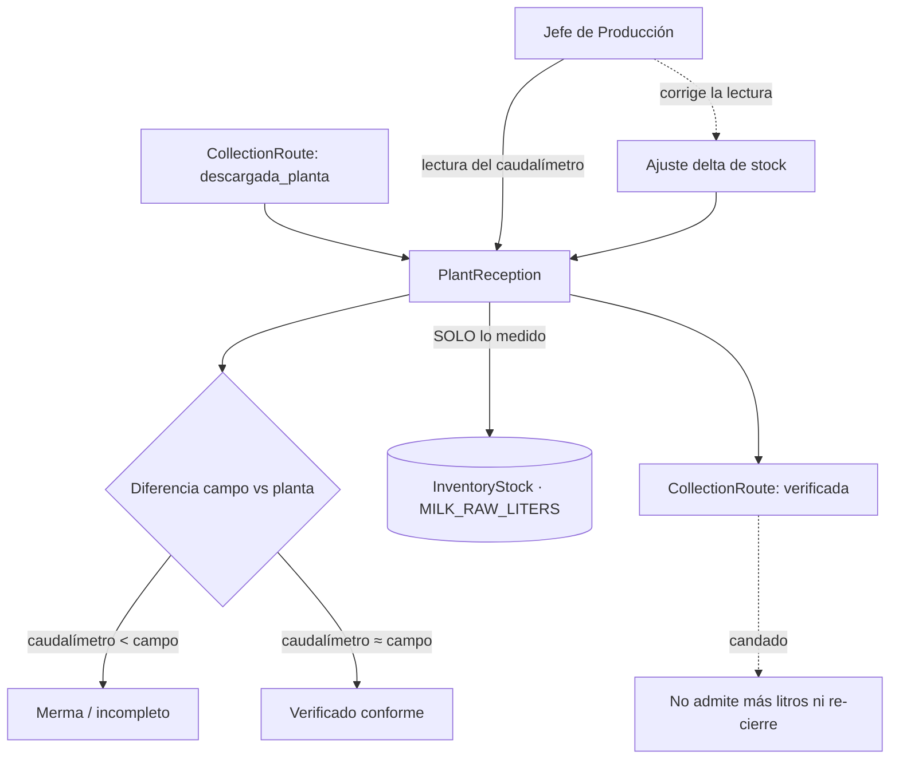

# 🏭 Módulo: Planta y Caudalímetro

> La quesería dejó de ser un módulo aparte (auditoría `$archi` 2026-09-22). Lo que se hace con la leche vive ahora en **[Producción](produccion.md)**: el producto trae su receta y consume lo que diga, en vez de 10 L fijos por molde.

## 1. Verificación y merma

## 2. Componentes

| Componente | Archivo | Responsabilidad |
|---|---|---|
| `PlantaService` | `app/Services/Planta/PlantaService.php` | Verificación, merma y delta de stock. **Único** camino de la leche al almacén |
| `PlantReception` | `app/Models/PlantReception.php` | Lectura del caudalímetro, estado de verificación y observación |
| `PlantReceptionController` | `app/Http/Controllers/PlantReceptionController.php` | `/planta/verificacion` |
| Vista | `resources/views/planta/verificacion.blade.php` | Pantalla del jefe de planta |
| Comando móvil | `verificar_recepcion` | Mismo servicio desde el teléfono |

## 3. Reglas

* **Ingreso estricto por caudalímetro.** La leche entra a inventario únicamente al pasar por el medidor de planta, nunca por lo declarado en ruta. Sin esto la merma no se puede medir.
* **Corrección por delta.** Si el jefe corrige una lectura previa, el stock recibe solo la diferencia, no el total otra vez.
* **El caudalímetro es lo último que toca la ruta.** Una ruta `verificada` no admite litros nuevos ni se puede volver a descargar — ver [Acopio](acopio.md).
* **Aislamiento operativo.** El jefe de producción no ve el dashboard general: `/dashboard` lo lleva a `/planta/verificacion`.

## 4. Tests

`tests/Feature/RutaDeAcopioCierreTest.php` cubre el candado de la ruta verificada (servicio, web y móvil).
