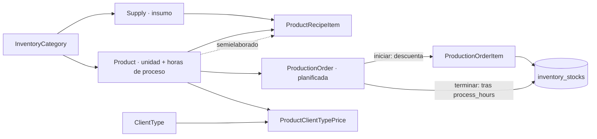
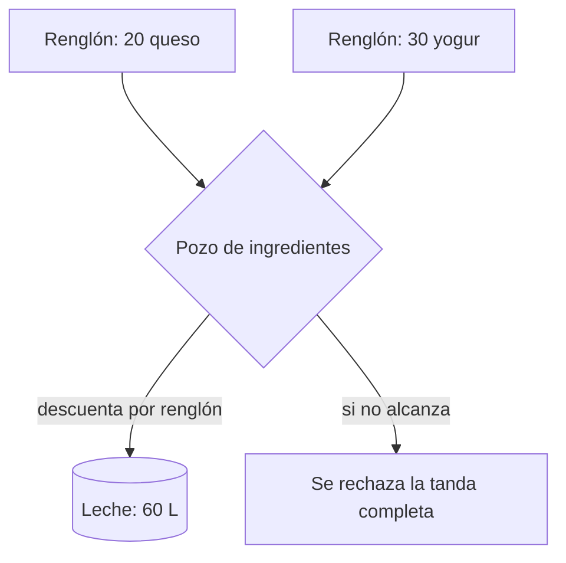

# 📦 Módulo: Producción — catálogo, recetas y lotes

> Reemplaza a la antigua Quesería. La planta define sus propios productos sin tocar código: categorías, insumos, unidades, recetas y tiempos son **datos**, no constantes de PHP.

## 1. Cadena del catálogo

Un renglón de receta apunta a **un insumo comprado** (`supply_id`) o a **un producto que la planta ya fabricó** (`component_product_id`) — así se expresa un semielaborado. `CatalogoService` impide ciclos (A lleva B y B lleva A) y `recipeCost()` corta a profundidad 10.

## 2. El almacén es uno solo

Al programar varios productos en una tanda, **no alcanza con que cada renglón quepa por separado**: salen del mismo almacén. `ProduccionService::planificarVarios()` arma un pozo por ingrediente y lo descuenta renglón por renglón. O entran todos o no entra ninguno.

## 3. Componentes

| Componente | Archivo | Responsabilidad |
|---|---|---|
| `CatalogoService` | `app/Services/Produccion/CatalogoService.php` | Categorías, unidades, insumos, productos, recetas, tarifas |
| `AlmacenService` | `app/Services/Produccion/AlmacenService.php` | **Único** punto de movimiento de stock; escribe el kardex |
| `ProduccionService` | `app/Services/Produccion/ProduccionService.php` | Planificar (uno o varios), iniciar, terminar, cancelar |
| `InventoryCategoryController` | `/produccion/categorias` | Categorías y unidades de medida |
| `CatalogoAlmacenController` | `/produccion/almacen` | Insumos, stock, mínimos y kardex |
| `ProductCatalogController` | `/produccion/productos` | Receta y tarifa por tipo de cliente |
| `ProductionOrderController` | `/produccion/lotes` | Ciclo de vida del lote |
| `MeasurementUnit`, `SupplyMovement` | `app/Models/` | Unidad configurable y kardex |

## 4. Permisos

| Rol | Categorías / Almacén / Productos | Lotes |
|---|---|---|
| `jefe_produccion` | administra | **opera**: crea, inicia, termina, cancela |
| `admin`, `jefe_general` | administra | **solo lee el reporte** |

`ProductionOrderController::ROLES_LECTURA` vs `ROLES_OPERACION`. Quien está frente a la tina es el único que sabe si el lote arrancó.

## 5. Reglas

* **Producir toma tiempo.** `iniciar` descuenta los insumos; `terminar` solo pasa si `expected_ready_at` ya venció.
* **Cancelar devuelve.** Anular un lote en proceso reintegra al almacén todo lo consumido.
* **Todo movimiento deja rastro.** `AlmacenService::mover()` escribe en `supply_movements` el motivo, el saldo resultante, el lote y el responsable.
* **El número de lote lleva correlativo.** Programar la tanda del día registra varios lotes en el mismo segundo; `batch_number` es único y se le agrega correlativo cuando ya está tomado.
* **Tarifa por producto y tipo de cliente.** El precio no es del tipo de cliente sino del cruce producto × tipo — ver [Ventas](ventas_calidad.md).

## 6. Limitación conocida

Consumir un **producto componente** no deja rastro en `supply_movements`: la FK de esa tabla es NOT NULL contra `supplies`. Queda registrado en `production_order_items`.

## 7. Pendiente

Insumos **reutilizables** (búlgaros, cultivos de yogur): hoy todo insumo se consume y no vuelve. Los cultivos salen, trabajan y regresan al stock, a veces con más cantidad porque crecen. Plan acordado, a la espera de que la asociación confirme qué cultivos usa.

## 8. Tests

`CatalogoProduccionTest`, `SemielaboradoTest`, `LotesCompartenAlmacenTest`, `AlmacenClasificadoTest`.
