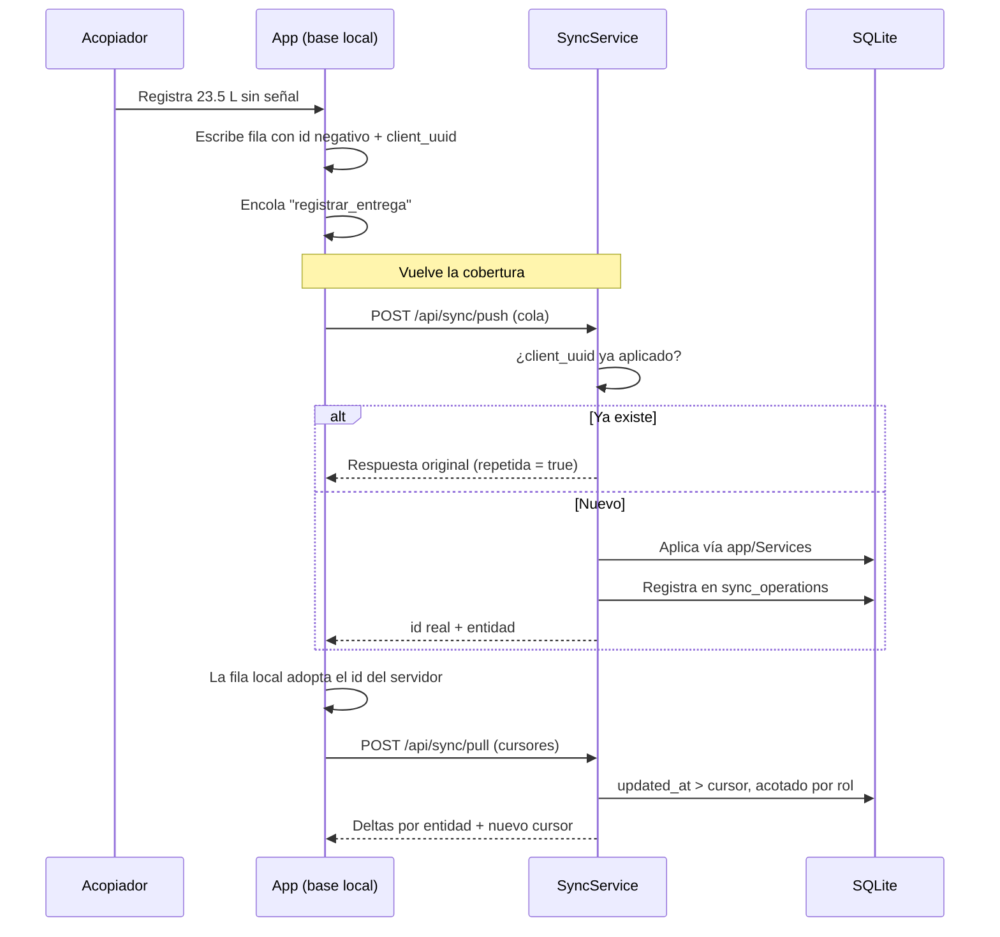

# 🔄 Módulo: Sincronización Offline-First

Contrato entre `MilkFlowWeb` y `MilkFlowMovil`. Una sola regla lo gobierna: **primero sube lo que se hizo sin señal, después baja lo que cambió en la planta**, para que la bajada nunca pise trabajo que aún no llegó al servidor.

## 1. Ciclo Completo

## 2. Componentes Clave

| Componente | Archivo | Responsabilidad |
|---|---|---|
| Catálogo | `MilkFlowWeb/config/sync.php` | Entidades, columnas que viajan, ámbito por rol, orden de bajada y comandos permitidos |
| `ResolutorAmbito` | `app/Services/Sync/ResolutorAmbito.php` | Traduce el ámbito declarado a un filtro de consulta |
| `SyncService` | `app/Services/Sync/SyncService.php` | `pull` por cursor y `push` de la cola de comandos |
| `SyncOperation` | `app/Models/SyncOperation.php` | Bitácora de idempotencia (`client_uuid` único) |
| `SyncController` | `app/Http/Controllers/Api/SyncController.php` | Login por DNI o correo, pull, push y ciclos de pago |
| `ReglaNegocioException` | `app/Exceptions/ReglaNegocioException.php` | Marca un rechazo definitivo: el móvil no debe reintentar |
| `Sincronizador` | `MilkFlowMovil/shared/.../datos/Sincronizador.kt` | Sube la cola, aplica los resultados y fusiona los deltas |

## 3. Ámbitos de Visibilidad por Rol

Lo que no pasa por aquí nunca llega al teléfono.

| Ámbito | Significado |
|---|---|
| `todos` | Todas las filas de la entidad |
| `ninguno` | El rol no recibe la entidad |
| `propio:<columna>` | Filas cuya columna coincide con el id del usuario |
| `padron` | Productores, acopiadores y uno mismo |
| `mis_rutas` / `mis_registros` | Filas colgadas de rutas que conduce ese acopiador |
| `mis_compras` | Ventas cuyo cliente está vinculado a ese productor |
| `avisos` | Anuncios generales, del rol o dirigidos a esa persona |

## 4. Los 17 Comandos de Subida

| Dominio | Comandos |
|---|---|
| Acopio | `abrir_ruta` · `registrar_entrega` · `cerrar_ruta` · `asignar_ruta` |
| Planta | `verificar_recepcion` |
| Ventas | `registrar_venta` · `cerrar_caja` |
| Calidad | `registrar_analisis` · `agendar_visita` · `completar_visita` |
| Zonas | `solicitar_cambio_zona` · `revisar_solicitud_zona` |
| Pagos | `autorizar_pago` · `entregar_sobre` |
| Sistema | `registrar_egreso` · `actualizar_tarifas` · `publicar_aviso` |

Cada comando declara en `config/sync.php` qué roles pueden ejecutarlo; el resto se rechaza antes de tocar la base.

## 5. Reglas Operativas

1. **Idempotencia por `client_uuid`.** Reenviar una operación devuelve la respuesta guardada en `sync_operations` en lugar de repetir el efecto. Es lo que hace seguro reintentar tras un corte a mitad de petición.
2. **Rechazo ≠ error de red.** Una `ReglaNegocioException` (stock insuficiente, sobre no autorizado, ruta ya verificada) se responde como `rechazada`: el móvil deshace su cambio optimista y lo muestra en la pantalla Sincronización. Un fallo de transporte deja la operación en cola para reintentar.
3. **La ruta puede nacer en el teléfono.** `registrar_entrega` acepta el `ruta_client_uuid` de una ruta abierta sin señal; el servidor la crea si no existe y **le asigna la zona libre definitiva**, que puede no ser la que adivinó el teléfono.
4. **Cursor como fecha, no como texto.** El cursor de bajada se pasa al motor como objeto de fecha; enviado como texto ISO, SQLite lo compararía carácter a carácter (`'T' > ' '`) y se perderían todos los cambios.
5. **Margen de reloj de 2 segundos.** La bajada resta ese margen al cursor: reenvía a propósito unas pocas filas ya conocidas (el móvil las reescribe) antes que perder un cambio por desfase de relojes.
6. **Entidad nueva, alta obligatoria.** Una tabla que deba llegar al teléfono se declara en `config/sync.php`; si además el móvil escribirá en ella, se agrega su comando en `SyncService`.
