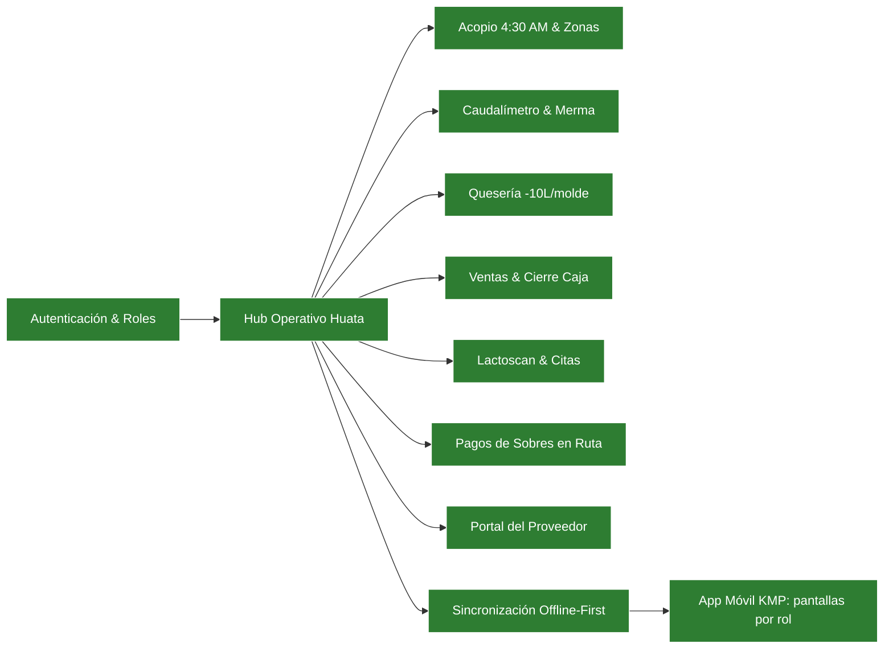

# Tracker: arquitectura y rutas

## Mapa de navegación

`done` = auditado y verificado · `active` = en trabajo actual · `pending` = pendiente.

---

## Componentes por capa

| ID | Capa | Componente / Archivo | Estado | Notas |
|---|---|---|---|---|
| a1 | Presentation | `resources/views/` (Blade + Spark Admin) | activo | Interfaces ergonómicas y aisladas por rol |
| a2 | Application / Controllers | `app/Http/Controllers/` | activo | Controladores de flujo de negocio y endpoints API Sanctum |
| a3 | Domain Models | `app/Models/` | activo | Entidades relacionales, helpers de precio y stock atómico |
| a4 | Infrastructure / Persistence | SQLite / MySQL + Migrations | activo | Esquema relacional con integridad referencial completa |
| a5 | Domain Services | `MilkFlowWeb/app/Services/` | activo | Fuente única de las reglas de Huata para el web y el móvil |
| a6 | Sync Engine | `app/Services/Sync/` + `config/sync.php` | activo | Bajada por cursor, cola de 18 comandos e idempotencia por `client_uuid` |
| a7 | Presentation Móvil | `MilkFlowMovil/shared/.../ui/` | activo | Compose Multiplatform; pantallas por rol que solo leen de la base local |
| a8 | Data Móvil | `MilkFlowMovil/shared/.../datos/` | activo | Documento JSON local, cola de operaciones y cliente Ktor |

---

## Decisiones de arquitectura (ADR mínimo)

### [2026-09-13] Rol de Pagador de Campo y Sobres Condicionados a Autorización
- **Contexto:** En Huata, el miércoles se cierra caja, el jueves se cuentan sobres físicos y el viernes el pagador acompaña al acopiador en la camioneta para pagar en efectivo. No se debe disponer de dinero si la liquidación no fue autorizada por el Admin.
- **Decisión:** Crear el rol `pagador_campo` ("solo de pagos") con módulo `/pagos/ruta`. Si la liquidación no cuenta con autorización previa (`status = autorizado`), el efectivo no figura (`— Sin Autorizar`), no se suma a la custodia de la camioneta y el botón de entrega permanece bloqueado. Al autorizar el Admin, se habilita la entrega y al pagarse pasa a `status = pagado` registrando al pagador (`paid_by`).
- **Consecuencias:** Control financiero blindado, sin discrepancias entre el dinero contado el jueves y el entregado el viernes.
- **Agente que decidió:** Gemini 3.8 Flash

### [2026-09-13] Ingreso a Stock Estricto por Caudalímetro Real
- **Contexto:** En planta, el volumen declarado por el acopiador puede tener espuma o merma de transporte respecto al caudalímetro.
- **Decisión:** El inventario oficial `MILK_RAW_LITERS` incrementa estrictamente con el volumen del caudalímetro confirmado por el Jefe de Producción.
- **Consecuencias:** Stock oficial 100% calibrado, mermas auditadas y visibles para el acopiador en su historial.
- **Agente que decidió:** Gemini 3.8 Flash

### [2026-09-13] Cierre de Caja y Arqueo Diario con Diferenciación de Crédito
- **Contexto:** En ventas, los productores pueden llevar quesos a cuenta de su leche semanal, lo que genera una deducción pero no ingreso de efectivo físico inmediato en caja.
- **Decisión:** Separar estrictamente el Efectivo Físico en Caja del monto A Cuenta de Leche en el cuadro de arqueo diario.
- **Consecuencias:** Arqueos de caja diarios sin descuadres de efectivo.
- **Agente que decidió:** Gemini 3.8 Flash

### [2026-09-14] App Móvil Offline-First con Cola de Operaciones e Idempotencia
- **Contexto:** La mayor parte del acopio se registra a las 4:30 AM en zonas de Huata sin cobertura. Una app que dependa de la red en el momento del registro no sirve en ruta, y reintentar a ciegas al volver la señal duplicaría entregas.
- **Decisión:** Ninguna pantalla del móvil llama a la red: la UI lee de una base local y cada acción escribe ahí y encola una operación con `client_uuid`. El servidor guarda cada uuid aplicado en `sync_operations` y devuelve la respuesta original si la operación se reenvía. Las filas creadas sin señal usan ids negativos que adoptan el id real al confirmarse, y una `ReglaNegocioException` se responde como rechazo definitivo para que el dispositivo deshaga su cambio optimista en lugar de reintentar.
- **Consecuencias:** El acopiador trabaja la ruta completa sin señal y nada se duplica al sincronizar. Como contrapartida, toda regla de negocio debe vivir en `app/Services/` (compartida por web y móvil) y toda tabla nueva que deba viajar al teléfono debe darse de alta en `config/sync.php`.
- **Agente que decidió:** Claude Opus 5

### [2026-09-14] Reglas de Negocio Centralizadas en `app/Services/`
- **Contexto:** Las reglas de Huata (caudalímetro, 10 L por molde, tarifas de queso, penalidad semanal por agua, ciclo de sobres) vivían dentro de los controladores web. Al abrir el API móvil, cada regla habría quedado escrita dos veces y habrían derivado por separado.
- **Decisión:** Extraer la lógica a `app/Services/` (Acopio, Planta, Ventas, Calidad, Zonas, Pagos, Sistema) y hacer que tanto los controladores web como los comandos de sincronización deleguen en ellos.
- **Consecuencias:** El precio que ve el acopiador en el teléfono y el que calcula la planta son el mismo número por construcción. La suite del servidor (47 pruebas) cubre ambos caminos.
- **Agente que decidió:** Claude Opus 5
